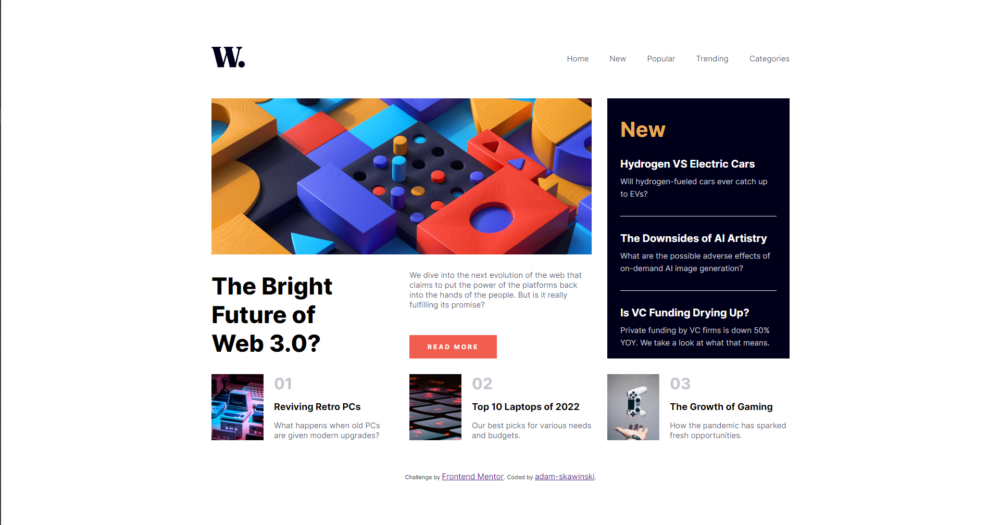
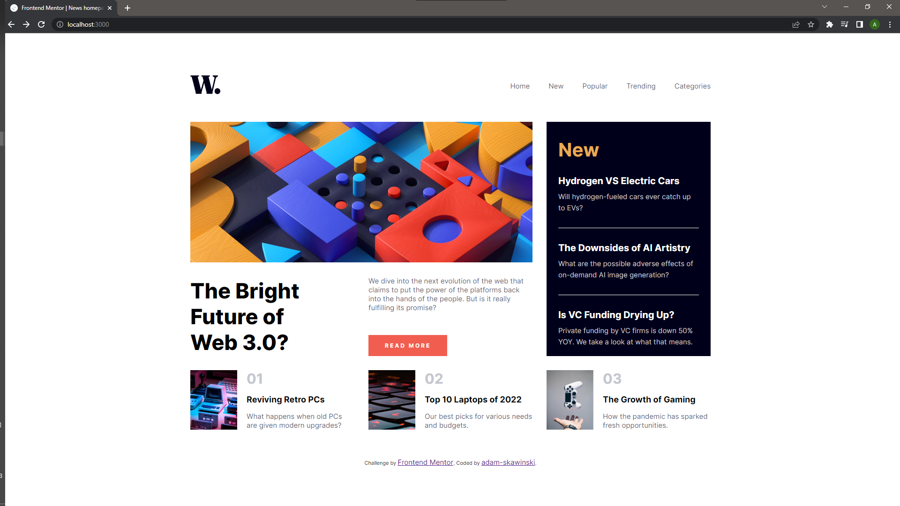
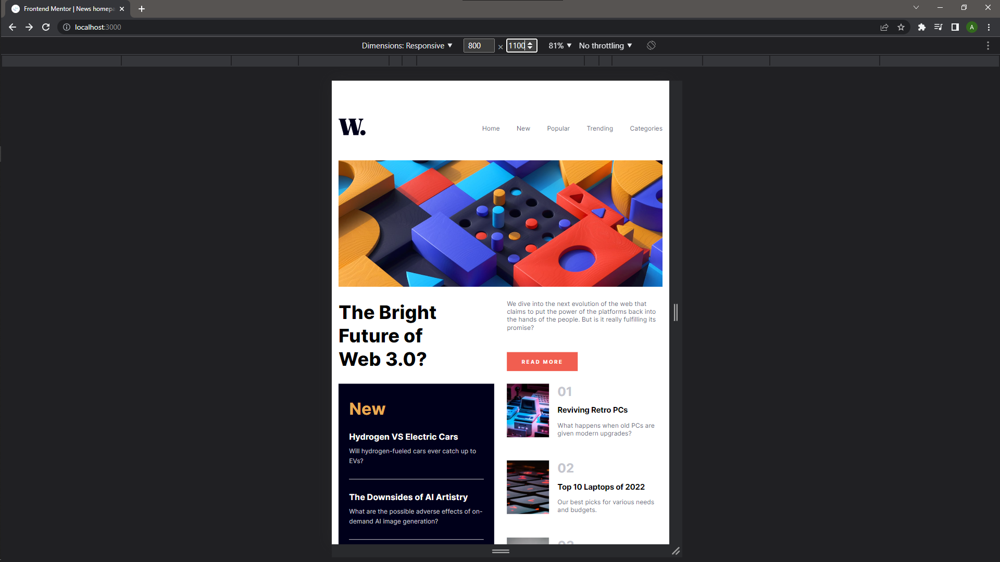
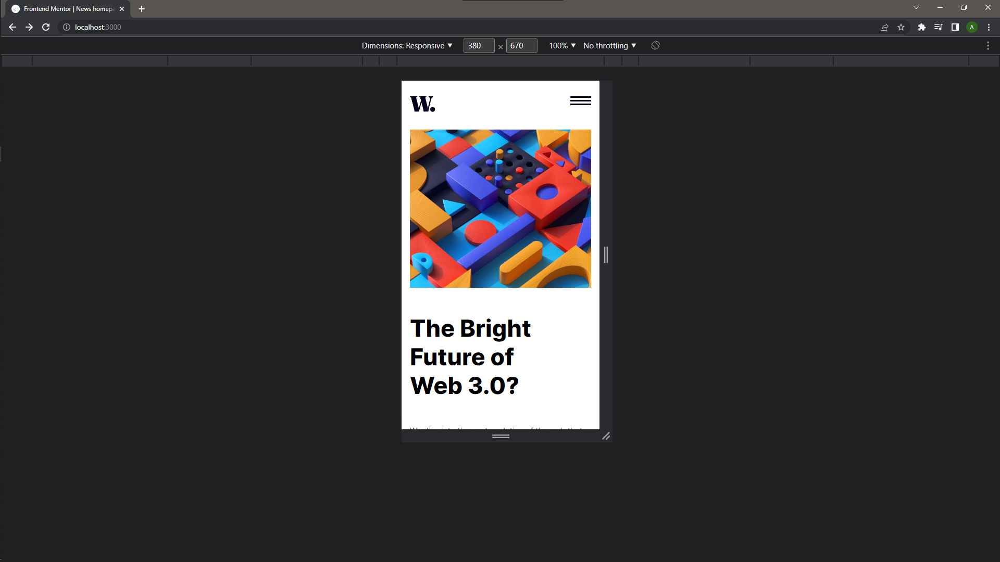
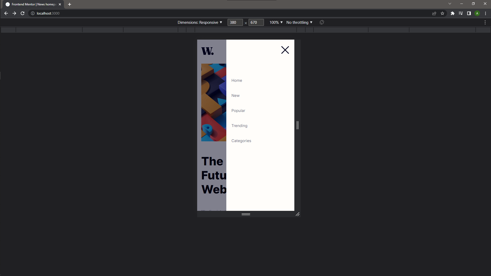

# Frontend Mentor - News homepage solution

This is a solution to the [News homepage challenge on Frontend Mentor](https://www.frontendmentor.io/challenges/news-homepage-H6SWTa1MFl). Frontend Mentor challenges help you improve your coding skills by building realistic projects. 

## Table of contents

- [Overview](#overview)
  - [The challenge](#the-challenge)
  - [Screenshot](#screenshot)
  - [Links](#links)
- [My process](#my-process)
  - [Built with](#built-with)
- [Author](#author)


## Overview



### The challenge

Users should be able to:

- View the optimal layout for the interface depending on their device's screen size
- See hover and focus states for all interactive elements on the page

### Screenshot

#### Desktop view


#### Tablet view


#### Mobile view


#### Mobile view with open menu



### Links

- Solution URL: [Add solution URL here](https://your-solution-url.com)
- Live Site URL: [Add live site URL here](https://your-live-site-url.com)

## My process
    I began by create default react app, then created responsive navbar component. In the next step made main page used grid.

### Built with

- HTML5
- SCSS
- Flexbox
- SCSS Grid
- SCSS variables & function 
- [React](https://reactjs.org/) - JS library
- [Next.js](https://nextjs.org/) - React framework


### SCSS function

I used this function to create responsive webside.

```scss
    @mixin tablet {
        @media (max-width: 1150px){
            @content;
        }
    }
    @mixin mobile {
        @media (max-width: 580px){
            @content;
        }
    }
```


## Author

- Website - [adam-skawinski](https://github.com/adam-skawinski)
- Frontend Mentor - [adam-skawinski](https://www.frontendmentor.io/home)